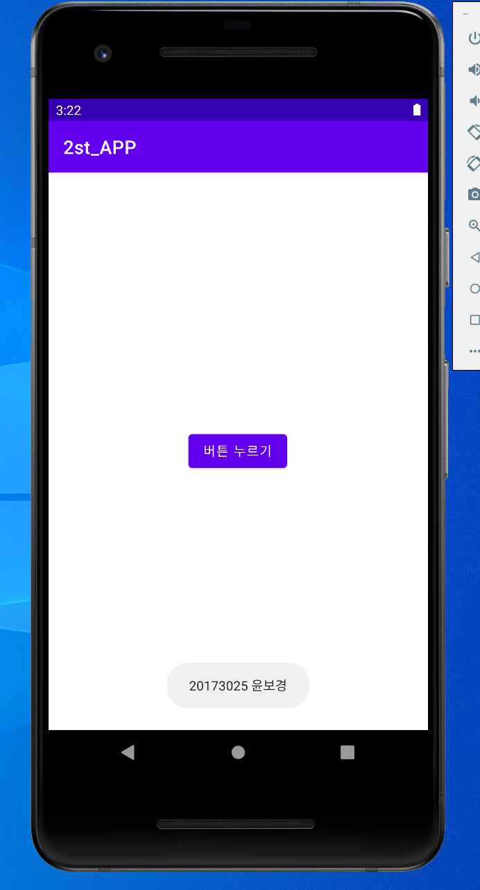
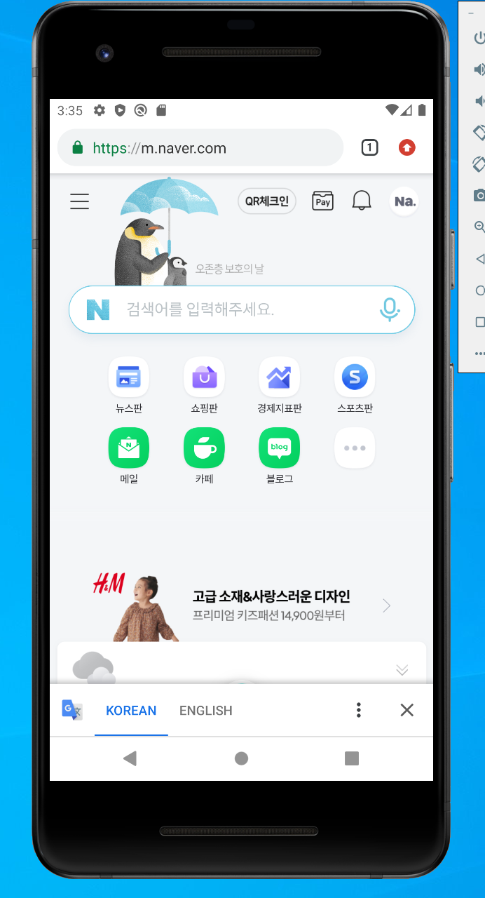
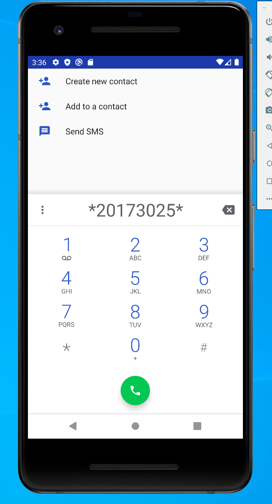
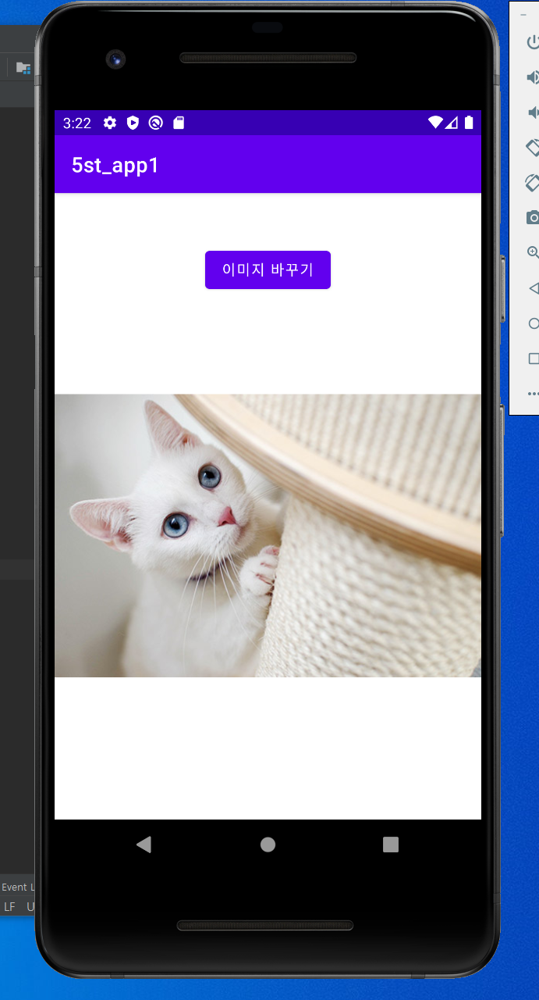
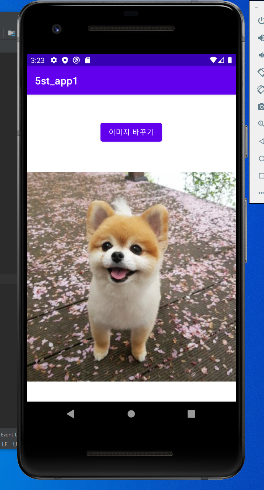
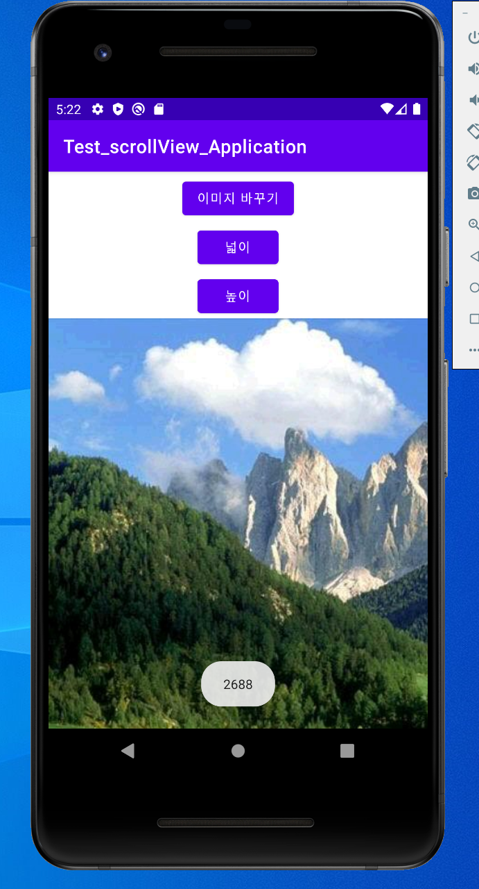
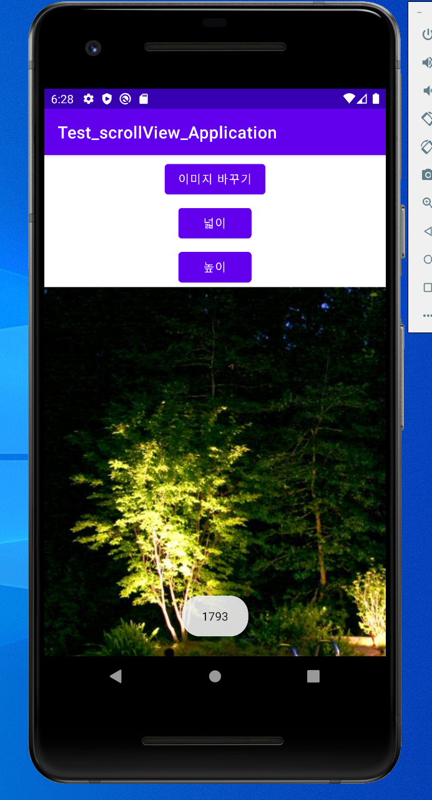

# 20173025 윤보경

## 1주차

## 2주차
- Github사용법

</img>

- 2주차 출석과제

</img>
## 3주차
- 3주차 과제

</img>
</img>

## 4주차
- 4주차 과제
   - 아이디어 명: 메뉴 추천 앱
   
      항상 무엇을 먹어야 할지 고민할 때가 많은데 카드 내역 데이터를 연동하거나 취향 진단 테스트를 통해 메뉴를 추천하고, 
      마음에 드는 음식을 검색할 수 있는 검색 기능을 추가한다. 그리고 가게에 대한 리뷰도 작성/읽기가 가능하고, 주변 관련 식당의 위치 서비스를 제공하며 
      식당의 메뉴 추천뿐만 아니라 사용자가 만든 메뉴 및 레시피와 편의점 꿀 조합을 공유할 수 있다. 또한 상황별 카테고리로도 나누어 제공할 계획이다. 
      또한 음식 사진을 찍어 기록하는 사람이 많은데 이 앱을 통해 음식 사진을 기록하는 기능을 제공하는 동시에 간단히 글을 쓸 수 있는 일기 형식을 제공해 
      추억도 함께 기록할 수 있다. 그리고 가게에서 가끔 종이 스탬프 쿠폰을 나누어 주기도 하는데 이 부분을 스마트 스탬프로 대체하여 제공하고, 그 쿠폰들을 모아 한 번에
      볼 수 있게 하는 서비스도 제공한다. 사용자들이 서로 무엇을 먹었는지 공유할 수 있는 커뮤니티 공간도 제공할 계획이다.

## 5주차
- 5주차 과제

</img>
</img>

## 6주차
- 6주차 과제

</img>
</img>

</img>
</img>

## 7주차
- 7주차 과제

</img>

## 9주차
- 9주차 과제

</img>

## 10주차
- 10주차 과제

</img>

## 11주차
- 11주차 과제

</img>

## 12주차
- 12주차 과제

</img>
